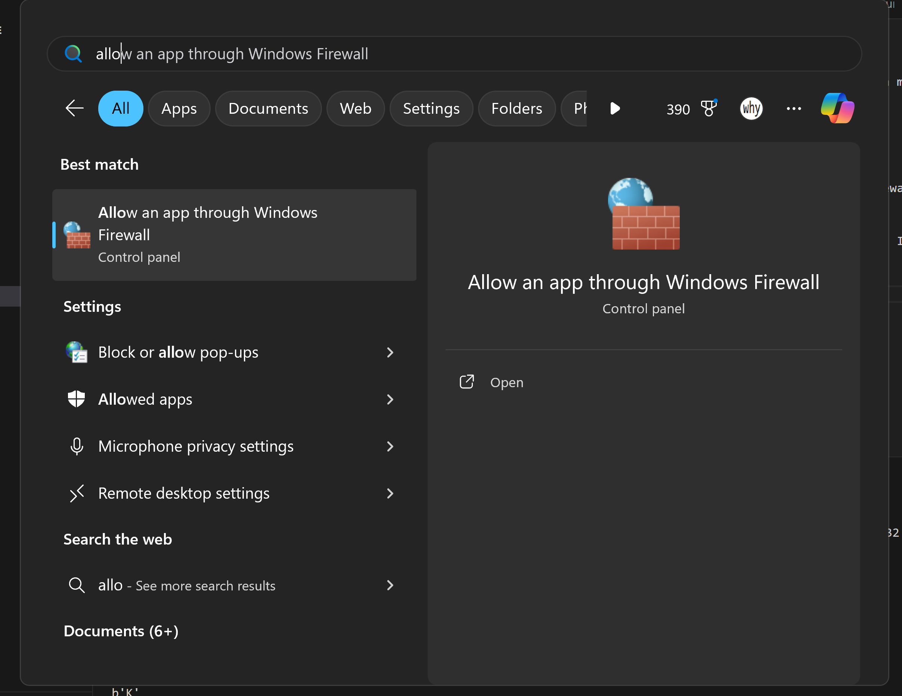
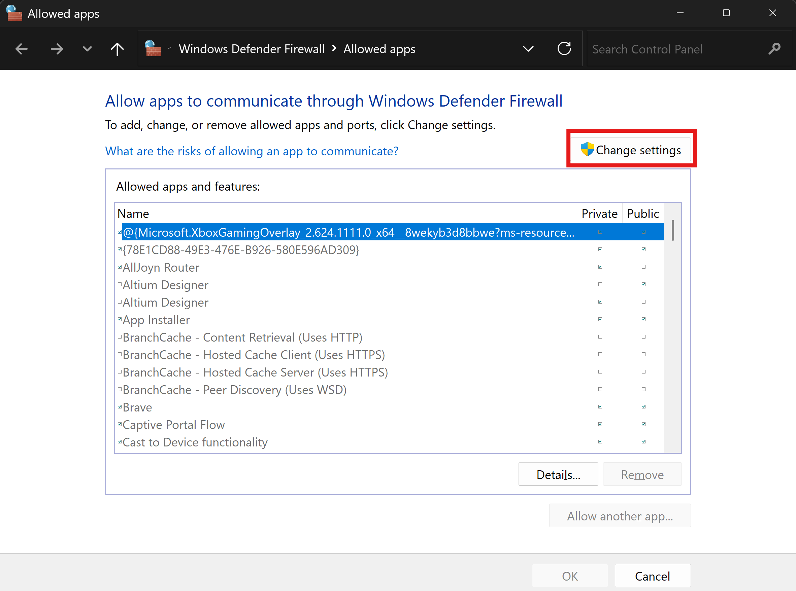
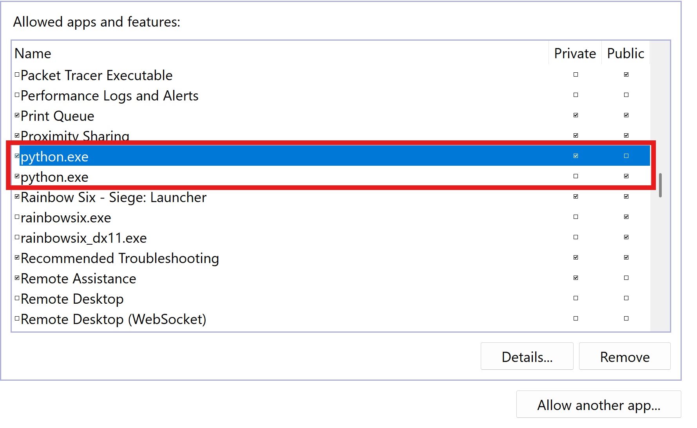
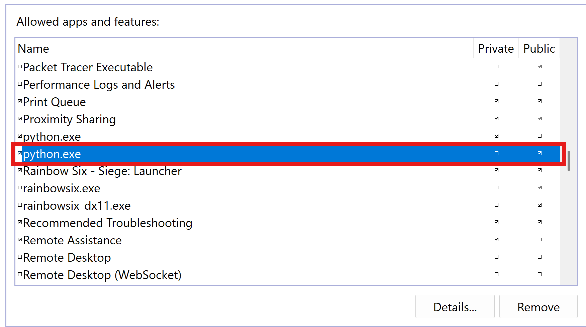
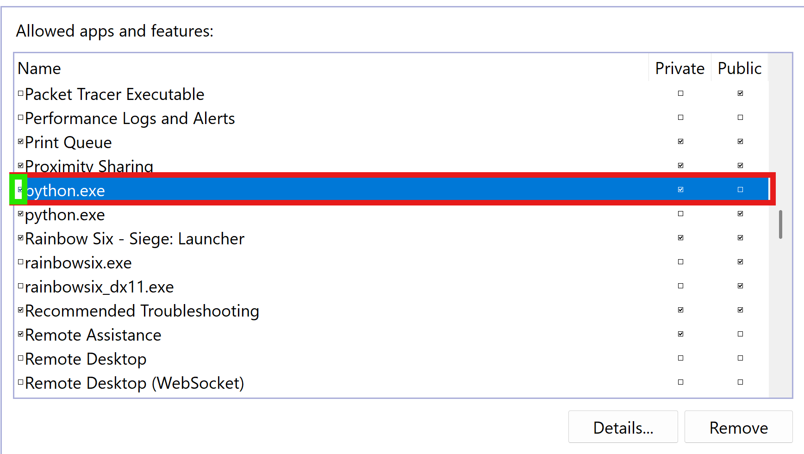

# Welcome to Alphons's Car Racing Game!
In this game, you, along with another player, are tasked with navigating a car through long roads with many obstacles, using your up and down arrows.

You have to get as far as possible, and have to avoid colliding with obstacles.

#### Before running the game, make sure to have NumPy installed, for Python mathematics support.

You can install it with `pip install numpy` or `python -m pip install numpy`

### Instructions for servers
In order to get the most enjoyability out of the game, you must allow Python through your Windows firewall for other computers to access the game.

Please keep in mind that the game has not been designed for security but performance and ease, and so, I only recommend doing this on networks you trust and only on LANs.

1. Go to "Allow an App through Firewall" on Windows

2. Within this program, click "Change settings". You may need administrator privileges.

3. Scroll down to where it says "python.exe", and tick the checkbox to the left of this to enable python to communicate for your respective network

For example:

If you were on a public network, you would tick the far left checkbox on this python option:
(See how the public option is ticked for this rule?)

If you were on a private network, you would tick the far left checkbox on this python option:

Click "Ok", and now Python has access to the network! Remember the server port is 6089. Afterwards, just reverse these steps to disable Python access to the network.

### To get your LAN IP address, you would go to the `cmd` and type `ipconfig`, and hit enter.

Most likely, the correct result will be in a network adaptor similar to `Wireless LAN adapter Wi-Fi:` under `IPv4 Address` or the like.