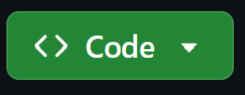
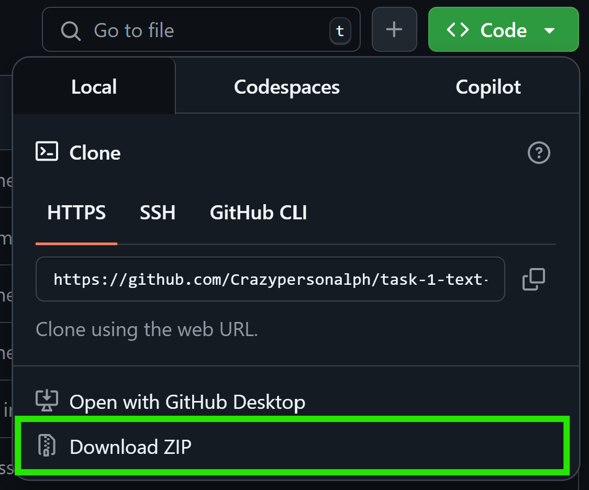

# Alphons's Networked Car Racing Game
See INFO.md for details about the game

For information about just a few bugs I found and fixed, see Errors.md

For my pseudocode, see pseudocode.md

### To play the game:
Download NumPy (`pip install numpy`) and run `python Client.py`.

### To download the code:
Either use the Git commandline or your favourite Git GUI tool (e.g. `git clone https://github.com/crazypersonalph/task-1-text-adventure`)

OR

Download the code as a zip file from the GitHub page under the `Code` dropdown menu above.

